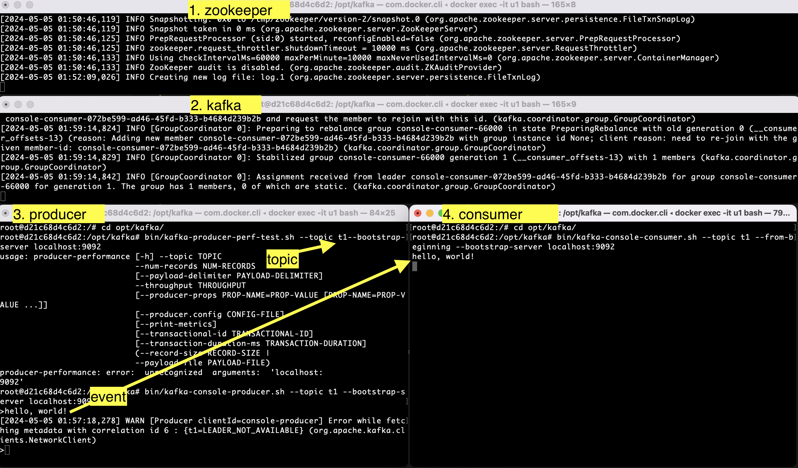

# Kafka

Summary notes on Kafka.

"Apache Kafka is an open-source distributed event streaming platform ... for high-performance data pipelines, streaming analytics, data integration, and mission-critical applications." [1]

[1] https://kafka.apache.org/quickstart

## Architecture

Kafka includes three key components: 

1. Kafka `Producers` to send `events`, under different `topics`, and optionally to different `partitions`. 
2. Kafka `Consumers` to receive events, by `subscribing` to different `topics`. Consumers are organized by in groups and identified by their `group id`.
3. Kafka `Broker` to coordinate Producer-Consumer relationships.

I ignored Apache ZooKeeper here, which is the default option to manage Kafka clusters, even when it is about a single node. 


## Setup

### 1. Install Java

Check if you have Java Runtime 8+ by running `java -version`, if not then install it:

Linux 

```
sudo apt-get install openjdk-8-jre
```

macOS
```
brew install openjdk

# And then 

brew info openjdk # to show what you need to do to make Java availble, e.g. 

...
For the system Java wrappers to find this JDK, symlink it with
  sudo ln -sfn /opt/homebrew/opt/openjdk/libexec/openjdk.jdk /Library/Java/JavaVirtualMachines/openjdk.jdk
...
If you need to have openjdk first in your PATH, run:
  echo 'export PATH="/opt/homebrew/opt/openjdk/bin:$PATH"' >> ~/.zshrc
``` 


### 2. Install and Run Kafka

Dowanloading kafka from https://dlcdn.apache.org/kafka/ , assuming it is in a folder named `kafka`:

Unzip:
```
# unzip in the same folder
tar -xzf kafka_2.13-3.7.0.tgz --strip-components=1
```

Start ZoooKeeper in one terminal:
```
bin/zookeeper-server-start.sh config/zookeeper.properties
```

And start Kafka in another terminal:
```
$ bin/kafka-server-start.sh config/server.properties
```

To test the system, open a new terminal for `Producer` and type a message:
```
$ bin/kafka-console-producer.sh --topic t1 --bootstrap-server localhost:9092
>hello, world!
>
```

And open another terminal for `Consumer` with the same topic, set to get messages from the beginning:
```
$ bin/kafka-console-consumer.sh --topic t1 --from-beginning --bootstrap-server localhost:9092
# It should print the messages sent via Producer
```

Screenshot: Test of Kafka. A "hello, world!" event produced under the topic "t1", and captured by the consumer. Bootstarp server is running on the localhost, listening to the default port 9092.



## Python + Kafka

Some Python packages to interface with Kafka:

1. [kafka-python](https://github.com/dpkp/kafka-python/tree/master), simple and probably most popular with 5.5k stars on github as of early 2024.

2. [confluent-kafka](https://github.com/confluentinc/confluent-kafka-python), backed by Confluent, the commercial maintainer of Kafka. It is built on a C/C++ Kafka library named `librdkafka`, presumably more performant.

3. [faust](https://github.com/robinhood/faust), known for stream processing. Initially developed by Robinhood brokerage, but currently maintained by the communinty, forked as [faust-streaming](https://github.com/faust-streaming/faust). 


